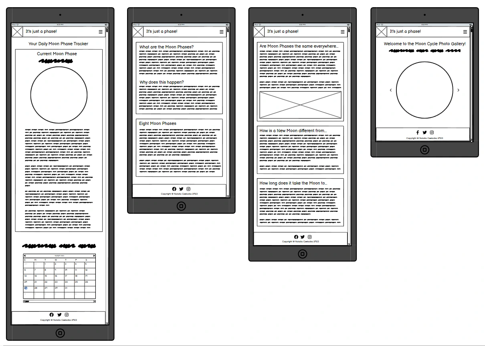

# It's just a phase! - your daily Moon Phase Tracker

"It's just a phase!" is a simple online tool that allows you to track the Moon Cycle. It displays the current Moon Phase alongside its image and detailed description. Additionally, it offers other relevant information such as the approximate distance between the Moon and Earth, the percentage of the Moon that is currently visible, the number of days until the next Full Moon etc., all of which are updated daily. The website also explains how the Moon Cycle works; it lists and describes all phases of the Moon. Finally, it showcases the changes in the Moon's surface throughout the cycle with a small photo gallery. The site is composed of four pages: Current Moon Phase, Moon Cycle Explained, FAQ, and Gallery.

"It's just a phase!" deployed website is available [here](https://nataliaczeladka.github.io/its-just-a-phase/).

## Table of Contents

- [It's just a phase! - your daily Moon Phase Tracker](#its-just-a-phase---your-daily-moon-phase-tracker)
  - [Table of Contents](#table-of-contents)
  - [User Experience (UX)](#user-experience-ux)
    - [User Stories](#user-stories)
      - [Client Goals](#client-goals)
      - [First Time User Goals](#first-time-user-goals)
      - [Returning User Goals](#returning-user-goals)
      - [Frequent User Goals](#frequent-user-goals)
  - [Design](#design)
    - [Colour Scheme](#colour-scheme)
    - [Typography](#typography)
    - [Imagery](#imagery)
    - [Wireframes](#wireframes)
    - [Features](#features)
      - [Existing Features](#exisiting-features)
      - [Future Features](#future-features)
  - [Technologies Used](#technologies-used)
    - [Languages Used](#languages-used)
    - [Frameworks, Libraries and Programs Used](#frameworks-libraries-and-programs-used)
  - [Testing](#testing)
  - [Deployment](#deployment)
    - [Deploying the project to GitHub Pages](#deploying-the-project-to-github-pages)
    - [Forking the GitHub repository](#forking-the-github-repository)
    - [Making a local clone](#making-a-local-clone)
  - [Credits](#credits)
    - [Code](#code)
    - [Content](#content)
    - [Media](#media)
    - [Acknowledgements](#acknowledgements)

## User Experience (UX)

### User Stories

#### Client Goals

- To provide users with accurate and up-to-date information about the current phase of the Moon. This could include displaying the Moon's appearance, percentage of illumination, distance to the Moon from Earth, and other relevant details.
- To educate users about the different phases of the Moon and the science behind them. It could provide explanations, diagrams, and relevant images to help users understand the lunar cycle.
- To provide a visual calendar that displays the Moon phases for a specific period (e.g., a year) that can help users track the Moon's changing appearance over time.
- To deliver all of the above in the form of a visually appealing, intuitive, responsive across different devices and easy to navigate website.

#### First Time User Goals

- To quickly and easily see the current phase of the Moon, whether it's a Full Moon, New Moon, Waxing Crescent, Waning Gibbous, etc.
- Users might be interested in accessing more than just the current Moon Phase. They might want additional information such as Moon illumination percentage, number of days through the cycle, number of days till the next Full Moon, etc.
- To explore a calendar view that shows the Moon's phases for a specific period, helping them understand how the Moon's appearance changes over time.
- To learn about the different phases of the Moon and their significance. They might be curious about why the Moon's appearance changes over time.
- To navigate throughout the page in an easy, effortless and intuitive way.
- To have a positive and enjoyable experience while browsing the website.

#### Returning/Frequent User Goals

- To continue tracking the Moon's changing phases to deepen their understanding of lunar patterns and cycles.
- To plan upcoming activities that align with specific Moon phases, such as outdoor events, photography sessions, or astronomical observations.
- To revisit the website's settings to fine-tune their preferences, such as adjusting time zones or choosing favorite locations.
- To share their own observations, photos, or experiences related to Moon phases within the website's community.
- To stay informed about upcoming celestial events beyond Moon phases, such as meteor showers, planetary alignments, asteroids and comets.
- To access the provider's social media accounts.
- To offer feedback to the app developers based on their experiences, helping to shape future updates and improvements.

## Design

### Colour Scheme

The colour scheme of "It's just a phase!" Moon Cycle Tracker was generated from its background picture, which captures the beauty of a night, starry sky. Because it plays a crucial role in setting the tone and atmosphere of the app, I wanted to keep it simple and elegant by introducing the classic combination of black and white, alongside a few subtle shades of blue and grey to emphasize a connection to the astronomical theme. The strongest colour accent of the website is a mid-toned, golden ochre shade called buff, which refers to the colour of natural, undyed leather. I believe it provides a nice contrast to the darker shades, adding a touch of warmth and balance to the overall colour scheme.

I used [Coolors](https://coolors.co/777777-d39b5b-ffffff-606e97-2e3451-04030e) to generate my colour palette.

### Typography

The combination of well-matching Playfair Display and Quattrocento fonts was suggested by one of the font pairing services called [fontpair.co](https://www.fontpair.co/). These fonts create a great contrast in a harmonising way. They enhance the visual hierarchy of the website and highlight essential information.

- The [Playfair Display](https://fonts.google.com/specimen/Playfair+Display?query=playfair) font is well-suited for titling and headlines, which makes it a perfect choice for the website's main logo and sections' headings. It's eye-catching, sophisticated and it easily draws attention

- The [Quattrocento](https://fonts.google.com/specimen/Quattrocento?query=quattro) font is the main font used throughout the whole website with Serif as the fallback font. It's a classic and elegant typeface that ensures easy readability. It was mainly used to provide text content to the paragraphs.

[Font Awesome](https://fontawesome.com/) icons were used throughout the site, such as the social media icons in the footer.

### Imagery

Imagery plays a vital role in capturing the awe-inspiring beauty of the Moon in "It's just a phase!" Moon Phase Tracker. Its main purpose is to inspire and immerse visitors in the captivating world of the lunar cycle - and to encourage them to expand their knowledge on this topic.

The images used on the website were sourced from two leading providers of free stock photography:
- [Pexels](https://www.pexels.com/)
    - images of all eight Moon phases by [Maxwell Fury](https://pixabay.com/users/maxwellfury-4913791/),
- [Unsplash](https://unsplash.com/)
    - background image of all four pages: photo by [Des Récits](https://unsplash.com/@desrecits).

Phases of the Moon diagram was downloaded from [NASA's Solar System Exploration website](https://solarsystem.nasa.gov/resources/676/phases-of-the-moon/), credit: Bill Dunford. Data visualization of the Waning Crescent Moon as seen from the northern and southern hemispheres came from [NASA's Earth's Moon Website](https://moon.nasa.gov/inside-and-out/top-moon-questions/), credit: NASA’s Scientific Visualization Studio.

### Wireframes

### Wireframes

Wireframes were created using [Balsamiq](https://balsamiq.com/wireframes/) - the industry top wireframing software.

| Size | Screenshot |
| --- | --- |
| Mobile |  |
| Tablet |  |
| Desktop |  |

## Technologies Used

### Languages Used

- [HTML](https://en.wikipedia.org/wiki/HTML) - used for the main site content.
- [CSS](https://en.wikipedia.org/wiki/CSS) - used for the main site design and layout.
- [JavaScript](https://www.javascript.com) - used for user interaction on the site.

### Frameworks, Libraries and Programs Used

- [Am I responsive?](https://ui.dev/amiresponsive) - used to check the site's responsiveness and to create mockups.
- [Balsamiq](https://balsamiq.com/wireframes/) - used to create wireframes.
- [Bootstrap v5.3](https://getbootstrap.com/) - used to assist with responsiveness by utilizing its layout elements and responsive navigation.
- [Coolors](https://coolors.co/) - used to create the colour palette.
- [Font Awesome](https://fontawesome.com/) - used to provide icons across the website.
- [Fontpair](https://www.fontpair.co/all) - used for font pairing.
- [Free Convert](https://www.freeconvert.com/jpg-to-webp) - used to convert jpg/png images to webp format.
- [Google Chrome Dev Tools](https://developer.chrome.com/docs/devtools/) - used to inspect and debug the code.
- [Google Fonts](https://fonts.google.com/) - used to import the fonts that style all of the text content.
- [Git](https://git-scm.com/) - used for version control by utilizing VS Code's terminal.
- [GitHub](https://github.com/) - used to store the project's code and images in the repository.
- [GitHub Pages](https://pages.github.com/) - used to deploy the website.
- [Icon-Icons](https://icon-icons.com/) - used to provide the favicon.
- [Marked Library](https://marked.js.org/) - used to convert external API's response in markdown format to HTML.
- [Moon Phase API](https://rapidapi.com/MoonAPIcom/api/moon-phase/) - external API used as a provider of comprehensive astronomical data.
- [Tiny.png](https://tinypng.com/) - used to reduce the size of the image files.
- [Visual Studio Code](https://code.visualstudio.com/) - used as a code editor.