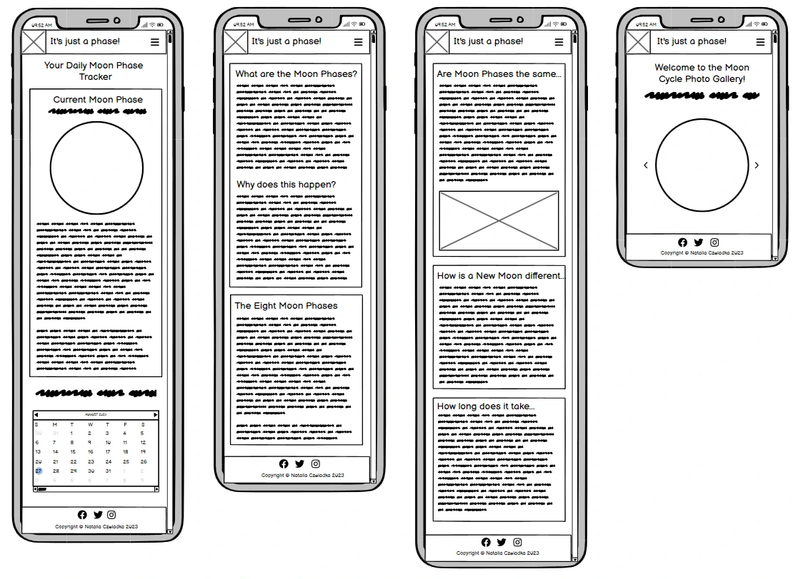
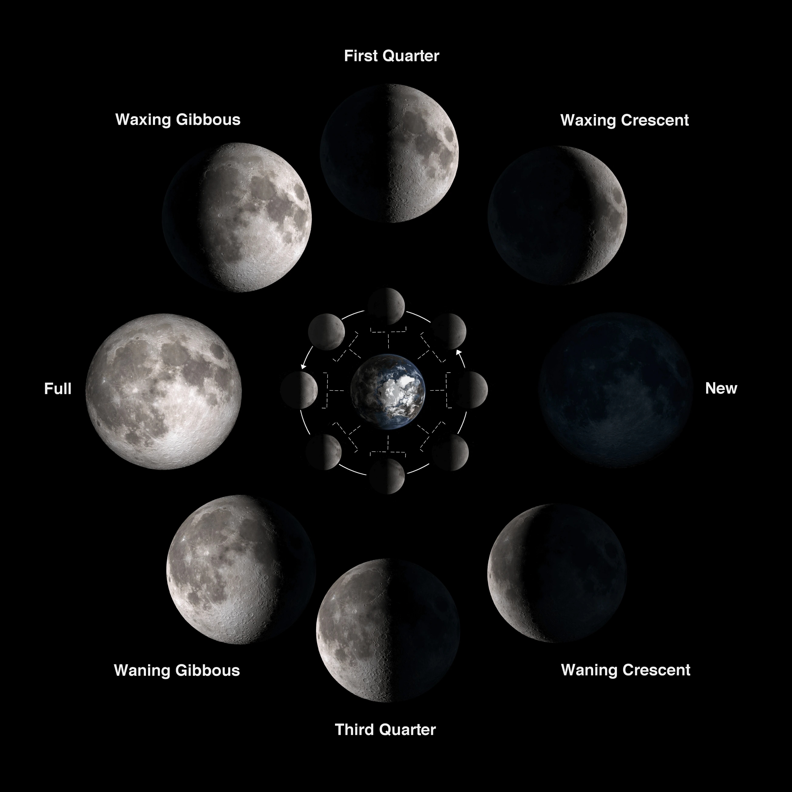

# It's just a phase! - your daily Moon Phase Tracker

"It's just a phase!" is a simple online tool that allows you to track the Moon Cycle. It displays the current Moon Phase alongside its image and detailed description. Additionally, it offers other relevant information such as the approximate distance between the Moon and Earth, the percentage of the Moon that is currently visible, the number of days until the next Full Moon etc., all of which are updated daily. The website also explains how the Moon Cycle works; it lists and describes all phases of the Moon. Finally, it showcases the changes in the Moon's surface throughout the cycle with a small photo gallery. The site is composed of four pages: Current Moon Phase, Moon Cycle Explained, FAQ, and Gallery.

"It's just a phase!" deployed website is available [here](https://nataliaczeladka.github.io/its-just-a-phase/).

## Table of Contents

- [It's just a phase! - your daily Moon Phase Tracker](#its-just-a-phase---your-daily-moon-phase-tracker)
  - [Table of Contents](#table-of-contents)
  - [User Experience (UX)](#user-experience-ux)
    - [User Stories](#user-stories)
      - [Client Goals](#client-goals)
      - [First Time User Goals](#first-time-user-goals)
      - [Returning/Frequent User Goals](#returningfrequent-user-goals)
  - [Design](#design)
    - [Colour Scheme](#colour-scheme)
    - [Typography](#typography)
    - [Imagery](#imagery)
    - [Wireframes](#wireframes)
    - [Features](#features)
      - [Existing Features](#exisiting-features)
      - [Future Implementations](#future-implementations)
  - [Technologies Used](#technologies-used)
    - [Languages Used](#languages-used)
    - [Frameworks, Libraries and Programs Used](#frameworks-libraries-and-programs-used)
  - [Testing](#testing)
  - [Deployment](#deployment)
    - [Deploying the project to GitHub Pages](#deploying-the-project-to-github-pages)
    - [Forking the GitHub repository](#forking-the-github-repository)
    - [Making a local clone](#making-a-local-clone)
  - [Credits](#credits)
    - [Code](#code)
    - [Content](#content)
    - [Media](#media)
    - [Acknowledgements](#acknowledgements)

## User Experience (UX)

### User Stories

#### Client Goals

- To provide users with accurate and up-to-date information about the current phase of the Moon. This could include displaying the Moon's appearance, percentage of illumination, distance to the Moon from Earth, and other relevant details.
- To educate users about the different phases of the Moon and the science behind them. It could provide explanations, diagrams, and relevant images to help users understand the lunar cycle.
- To provide a visual calendar that displays the Moon phases for a specific period (e.g., a year) that can help users track the Moon's changing appearance over time.
- To deliver all of the above in the form of a visually appealing, intuitive, responsive across different devices and easy to navigate website.

#### First Time User Goals

- To quickly and easily see the current phase of the Moon, whether it's a Full Moon, New Moon, Waxing Crescent, Waning Gibbous, etc.
- Users might be interested in accessing more than just the current Moon Phase. They might want additional information such as Moon illumination percentage, number of days through the cycle, number of days till the next Full Moon, etc.
- To explore a calendar view that shows the Moon's phases for a specific period, helping them understand how the Moon's appearance changes over time.
- To learn about the different phases of the Moon and their significance. They might be curious about why the Moon's appearance changes over time.
- To navigate throughout the page in an easy, effortless and intuitive way.
- To have a positive and enjoyable experience while browsing the website.

#### Returning/Frequent User Goals

- To continue tracking the Moon's changing phases to deepen their understanding of the lunar cycle.
- To plan upcoming activities that align with specific Moon phases, such as outdoor events, photography sessions, or astronomical observations.
- To revisit the website's settings to fine-tune their preferences, such as adjusting time zones or choosing favorite locations.
- To share their own observations, photos, or experiences related to Moon phases within the website's community.
- To stay informed about upcoming celestial events beyond Moon phases, such as meteor showers, planetary alignments, asteroids and comets.
- To access the provider's social media accounts.
- To offer feedback to the app developers based on their experiences, helping to shape future updates and improvements.

## Design

### Colour Scheme

The colour scheme of "It's just a phase!" Moon Cycle Tracker was generated from its background picture, which captures the beauty of a night, starry sky. Because it plays a crucial role in setting the tone and atmosphere of the app, I wanted to keep it simple and elegant by introducing the classic combination of black and white, alongside a few subtle shades of blue and grey to emphasize a connection to the astronomical theme. The strongest colour accent of the website is a mid-toned, golden ochre shade called buff, which refers to the colour of natural, undyed leather. I believe it provides a nice contrast to the darker shades, adding a touch of warmth and balance to the overall colour scheme.

I used [Coolors](https://coolors.co/777777-d39b5b-ffffff-606e97-2e3451-04030e) to generate my colour palette.

### Typography

The combination of well-matching Playfair Display and Quattrocento fonts was suggested by one of the font pairing services called [fontpair.co](https://www.fontpair.co/). These fonts create a great contrast in a harmonising way. They enhance the visual hierarchy of the website and highlight essential information.

- The [Playfair Display](https://fonts.google.com/specimen/Playfair+Display?query=playfair) font is well-suited for titling and headlines, which makes it a perfect choice for the website's main logo and sections' headings. It's eye-catching, sophisticated and it easily draws attention

- The [Quattrocento](https://fonts.google.com/specimen/Quattrocento?query=quattro) font is the main font used throughout the whole website with Serif as the fallback font. It's a classic and elegant typeface that ensures easy readability. It was mainly used to provide text content to the paragraphs.

[Font Awesome](https://fontawesome.com/) icons were used throughout the site, such as the social media icons in the footer.

### Imagery

Imagery plays a vital role in capturing the awe-inspiring beauty of the Moon in "It's just a phase!" Moon Phase Tracker. Its main purpose is to inspire and immerse visitors in the captivating world of the lunar cycle - and to encourage them to expand their knowledge on this topic.

The images used on the website were sourced from two leading providers of free stock photography:
- [Pexels](https://www.pexels.com/)
    - images of all eight Moon phases by [Maxwell Fury](https://pixabay.com/users/maxwellfury-4913791/),
- [Unsplash](https://unsplash.com/)
    - background image of all four pages: photo by [Des Récits](https://unsplash.com/@desrecits).

Phases of the Moon diagram was downloaded from [NASA's Solar System Exploration website](https://solarsystem.nasa.gov/resources/676/phases-of-the-moon/), credit: Bill Dunford. Data visualization of the Waning Crescent Moon as seen from the northern and southern hemispheres came from [NASA's Earth's Moon Website](https://moon.nasa.gov/inside-and-out/top-moon-questions/), credit: NASA’s Scientific Visualization Studio.

### Wireframes

Wireframes were created using [Balsamiq](https://balsamiq.com/wireframes/) - the industry top wireframing software.

| Size | Screenshot |
| --- | --- |
| Mobile |  |
| Tablet |  |
| Desktop |  |

### Features

#### Existing Features

"It's just a phase!" consists of four pages: Current Moon Phase, Moon Cycle Explained, FAQ and Gallery.

Some features are common for all of them. These are:

- Page Header - It's comprised of the logo in the top left corner, the site's name and the responsive navigation, which collapses on medium and small devices to the shape of a hamburger menu. The collapsed menu holds a list of links to all four pages. When the lines are clicked or tapped on, the menu slides into view. A link appears underlined when a user hovers over it. The active link stays underlined. The responsive navigation header was built using Bootstrap.

- Page Footer - It stretches across the entire width of the screen. It consists of social media links on the left side and copyright information on the right. It was created using Bootstrap's `container-fluid`. Social media icons change their colour to white when a user hovers over them.

Home page consists of:

- Main heading - It indicates clearly what's the website's main purpose. 

- First section - It's nearly entirely built of information obtained from the external source, which is Moon Phase API, a provider of comprehensive astronomical data. The information provided includes the name of a current Moon Phase, its image and description, an approximate distance to the Moon from Earth, a percentage of illumination, a current zodiac sign, a percentage of the complete Lunar Cycle, the number of days till the next Full Moon and the age of the Moon since the last New Moon. It's all wrapped in the `container-fluid`, which divides the section into three columns. On smaller devices they are stacked one below the other, the middle column first, then the left one and the right one at the end.

- Second Section - It consists of the heading, short instructions and the Lunar Cycle calendar for the current year. The calendar, like the previous section, is also the effect of consuming the Moon Phase API. This data was originally delivered in markdown format, but it was converted into HTML using the Marked Library (CDN link provided in the head of the index.html file). A horizontal scroll bar is added at the bottom of it to make the whole calendar accessible to users.

The second page, Moon Cycle Explained, consists of one section divided into three columns. On medium devices, they are stacked one below the other, on small ones the image in the middle is hidden. This section explains what are the Moon Phases and why our view of the Moon changes throughout the month. It also lists and describes all of the eight Moon Phases providing a graphical representation of how it all may look on the night sky.

The third page, Frequently Asked Questions, answers a few simple questions about the Moon Phases and the Moon Cycle in general. Like the previous page, this one also consists of just one section divided into three columns. On smaller devices, they are stacked one below the other. They are all placed on a slightly darker background than the main background picture to make the text fully visible and easy to read.

The fourth and last page, the Gallery, consists of the main heading, a short introduction and eight images illustrating eight Moon Phases - displayed in the form of an image carousel, which was created from scratch using JavaScript.

#### Future Implementations

- Moonrise and moonset parameters available on the website - depending on the user's location and their time zone (to meet the third returning/frequent user goal).
- Community Section - letting users interact with one another, discuss their ideas and share their resources (to meet the fourth returning/frequent user goal).
- Linking the website to another API providing data about near-Earth objects like asteroids, meteors, and comets (to meet the fifth returning/frequent user goal).
- Contact Us Section - to let users provide their feedback to the app developers based on their experiences, which may help with future updates and improvements (to meet the seventh returning/frequent user goal).

## Technologies Used

### Languages Used

- [HTML](https://en.wikipedia.org/wiki/HTML) - used for the main site content.
- [CSS](https://en.wikipedia.org/wiki/CSS) - used for the main site design and layout.
- [JavaScript](https://www.javascript.com) - used for user interaction on the site.

### Frameworks, Libraries and Programs Used

- [Am I responsive?](https://ui.dev/amiresponsive) - used to check the site's responsiveness and to create mockups.
- [Balsamiq](https://balsamiq.com/wireframes/) - used to create wireframes.
- [Bootstrap v5.3](https://getbootstrap.com/) - used to assist with responsiveness by utilizing its components and layout elements.
- [Coolors](https://coolors.co/) - used to create the colour palette.
- [Font Awesome](https://fontawesome.com/) - used to provide icons across the website.
- [Fontpair](https://www.fontpair.co/all) - used for font pairing.
- [Free Convert](https://www.freeconvert.com/jpg-to-webp) - used to convert jpg/png images to webp format.
- [Google Chrome Dev Tools](https://developer.chrome.com/docs/devtools/) - used to inspect and debug the code.
- [Google Fonts](https://fonts.google.com/) - used to import the fonts that style all of the text content.
- [Git](https://git-scm.com/) - used for version control by utilizing VS Code's terminal.
- [GitHub](https://github.com/) - used to store the project's code and images in the repository.
- [GitHub Pages](https://pages.github.com/) - used to deploy the website.
- [Icon-Icons](https://icon-icons.com/) - used to provide the favicon.
- [Marked Library](https://marked.js.org/) - used to convert external API's response in markdown format to HTML.
- [Moon Phase API](https://rapidapi.com/MoonAPIcom/api/moon-phase/) - external API used as a provider of comprehensive astronomical data.
- [Tiny.png](https://tinypng.com/) - used to reduce the size of the image files.
- [Visual Studio Code](https://code.visualstudio.com/) - used as a code editor.

## Testing

For all testing, please refer to the [TESTING.md](TESTING.md) file.

## Deployment

### Deploying the project to GitHub Pages

1. Log in to your GitHub account and locate the repository you would like to deploy.
2. Navigate to the "Settings" tab at the top of your selected repository.
3. Select "Pages" from the menu on the left-hand side of the screen.
4. Make sure the "Select" dropdown menu shows "Deploy from a branch".
5. From the "Branch" dropdown menu select "Main" and click "Save".
6. The page will automatically refresh and display the link to your deployed website.

### Forking the GitHub repository

By forking the repository, you make a copy of the original repository on your GitHub account to view or to make changes to, without affecting the original repository.

1. Log in to your GitHub account and locate the repository you would like to fork.
2. At the top of the repository on the right-hand side of the screen, locate the "Fork" button.
3. After clicking on it, you should have your own copy of the original repository in your GitHub account.

### Making a local clone

Making a clone is basically making a copy of the selected repository.

1. Log in to your GitHub account and locate the repository you would like to clone.
2. Click on the "Code" button just under the repository name.
3. Copy the HTTPS link from the website address bar.
4. Open a GitBash terminal and locate the directory where you want to place the clone.
5. Type 'git clone' and then paste the URL you copied earlier.
6. Press enter. Then your local clone will be created.

## Credits

### Code

- Code for the outline effect used on multiple occasions across the CSS stylesheet was taken from [Stack Overflow](https://stackoverflow.com/questions/4919076/outline-effect-to-text) and was slightly edited to fit the project's needs.

- Code for a sticky footer, that always stays on the bottom of the page regardless of how little content is on the page, was taken from [Materialize](https://materializecss.com/footer.html)'s website.

- Code for Get Date methods, letting me customise the date output, was taken from [W3Schools](https://www.w3schools.com/js/js_date_methods.asp).

- Code for calling external API was taken from [Moon Phase API](https://rapidapi.com/MoonAPIcom/api/moon-phase/)'s documentation.

- Code for converting markdown response into HTML output was taken from documentation of [Marked Library](https://marked.js.org/).

- Code for image carousel from gallery.js file was created following [Log Rocket Fronend Analytics](https://blog.logrocket.com/build-image-carousel-from-scratch-vanilla-javascript/)'s tutorial on how to build an image carousel from scratch using vanilla JavaScript.

- [Bootstrap v5.3](https://getbootstrap.com/) - Bootstrap's `container-fluid` was used throughout the project to make the site responsive. Bootstrap's `navbar` was used for the responsive navigation header.

### Content

- [NASA Science Space Place](https://spaceplace.nasa.gov/moon-phases/en/) - the information contained on the Moon Cycle Explained page.
- [Moon Connection Website](https://www.moonconnection.com/moon_phases.phtml) - the information contained on the Moon Cycle Explained page.
- [Space.com](https://www.space.com/18880-moon-phases.html) - the information contained on the Moon Cycle Explained page.
- [Astronomical Applications Department of the U.S. Naval Observatory](https://aa.usno.navy.mil/data/MoonPhases) - the information contained on the Moon Cycle Explained page.
- [NASA Science Earth's Moon](https://moon.nasa.gov/inside-and-out/top-moon-questions/) - the information contained on the FAQ page.
- [Love the Night Sky](https://lovethenightsky.com/moon-facts/) - the information contained on the FAQ page.

### Media

| Image | Source |
| --- | --- |
|  | Photo by [Des Récits](https://unsplash.com/@desrecits) on [Unsplash](https://unsplash.com/) |
|         | Photos by [Maxwell Fury](https://pixabay.com/users/maxwellfury-4913791/) on [Pexels](https://www.pexels.com/). |
|  | [NASA's Solar System Exploration Website](https://solarsystem.nasa.gov/resources/676/phases-of-the-moon/), credit: Bill Dunford |
|  | [NASA's Earth's Moon Website](https://moon.nasa.gov/inside-and-out/top-moon-questions/), credit: NASA’s Scientific Visualization Studio |

### Acknowledgements

- [Iuliia Konovalova](https://github.com/IuliiaKonovalova) (my Code Institute mentor) - for sharing her impressive knowledge, for her guidance, constructive feedback and for invaluable help with debugging my JavaScript code.
- [Callum Jones](https://www.linkedin.com/in/callum-jones-9b80941b8/) (Newcastle College cohort facilitator) - for his helpful advice and continuous encouragement throughout the creation of my website.
- [Code Institute Slack Community](https://code-institute-room.slack.com) - for the moral support; it kept me going during periods of self doubt and imposter syndrome.