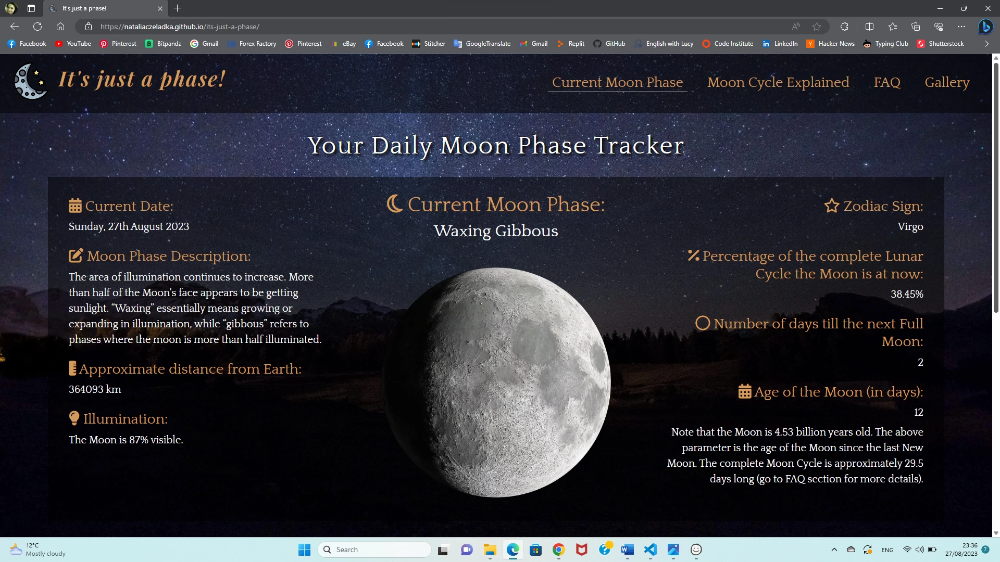
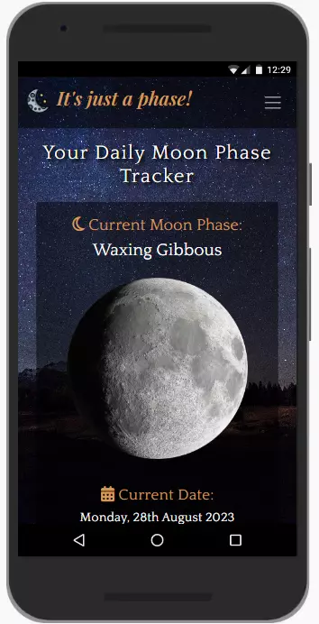
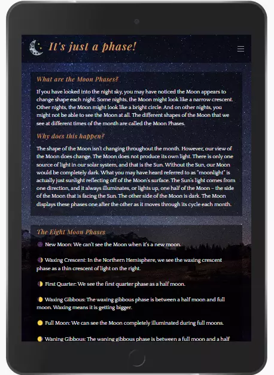

# Testing

Return back to the [README.md](README.md) file.

## Table of Contents

- [Testing](#testing)
  - [Table of Contents](#table-of-contents)
  - [Code Validation](#code-validation)
    - [HTML Validation](#html-validation)
    - [CSS Validation](#css-validation)
  - [Browser Compatibility](#browser-compatibility)
  - [Responsiveness](#responsiveness)
  - [Lighthouse Audit](#lighthouse-audit)
  - [User Stories Testing](#user-stories-testing)
    - [Client Goals](#client-goals)
    - [First Time User Goals](#first-time-user-goals)
    - [Returning User Goals](#returning-user-goals)
    - [Frequent User Goals](#frequent-user-goals)
  - [Fixed Bugs](#fixed-bugs)
  - [Unfixed Bugs](#unfixed-bugs)

## Code Validation

[The W3C Markup Validation Service](https://validator.w3.org/) and [The W3C CSS Validation Service](https://jigsaw.w3.org/css-validator/) were used to validate every page of the project to ensure there were no syntax errors. The results clearly showed that the website stays in compliance with the standards and recommendations set by the World Wide Web Consortium.

[JSLint](https://www.jslint.com/), a static code analysis tool, was used to check if JavaScript source code complies with coding rules.

### HTML Validation

I have used the recommended [HTML W3C Validator](https://validator.w3.org) to validate all of my HTML files. No errors or warnings were found.

| Page | W3C URL | Screenshot | Notes |
| --- | --- | --- | --- |
| Current Moon Phase | [W3C](https://validator.w3.org/nu/?doc=https%3A%2F%2Fnataliaczeladka.github.io%2Fits-just-a-phase%2Findex.html) |  | Pass: No Errors |
| Moon Cycle Explained | [W3C](https://validator.w3.org/nu/?doc=https%3A%2F%2Fnataliaczeladka.github.io%2Fits-just-a-phase%2Fcomment.html) |  | Pass: No Errors |
| FAQ | [W3C](https://validator.w3.org/nu/?doc=https%3A%2F%2Fnataliaczeladka.github.io%2Fits-just-a-phase%2Ffaq.html) |  | Pass: No Errors |
| Gallery | [W3C](https://validator.w3.org/nu/?doc=https%3A%2F%2Fnataliaczeladka.github.io%2Fits-just-a-phase%2Fgallery.html) |  | Pass: No Errors |

### CSS Validation

I have used the recommended [CSS Jigsaw Validator](https://jigsaw.w3.org/css-validator) to validate my CSS file. No errors were found.

| File | Jigsaw URL | Screenshot | Notes |
| --- | --- | --- | --- |
| style.css | [Jigsaw](https://jigsaw.w3.org/css-validator) |  | Pass: No Errors |

### JSLint Testing

I have used [JSLint](https://www.jslint.com/) to identify potential errors in my two JavaScript files. No errors were found.

| File | Screenshot | Notes |
| --- | --- | --- |
| script.js |  | No errors found
| gallery.js |  | No errors found

## Browser Compatibility

I have tested my deployed project on multiple browsers to check for compatibility issues.

| Browser | Screenshot | Notes |
| --- | --- | --- |
| Chrome |  | Works as expected |
| Firefox |  | Works as expected |
| Edge |  | Works as expected |
| Opera |  | Works as expected |

## Responsiveness

I have tested my deployed project on multiple devices to check for responsiveness issues. It responds well to different screen sizes ensuring that users can access and navigate the content effortlessly, regardless of their chosen device. No design or functionality issues were found.

| Device | Screenshot 1 | Screenshot 2 | Screenshot 3 | Screenshot 4 | Notes |
| --- | --- | --- | --- | --- | --- |
| Mobile (DevTools) |  |  |  |  | Works as expected |
| Tablet (DevTools) |  |  |  |  | Works as expected |
| Desktop |  |  |  |  | Works as expected |

## Lighthouse Audit

I have tested my deployed project using the Lighthouse Audit tool to check for any major issues. 

| Page | Size | Screenshot | Notes |
| --- | --- | --- | --- |
| Current Moon Phase | Mobile |  | Few warnings |
| Current Moon Phase | Desktop |  | Few warnings |
| Moon Cycle Explained | Mobile |  | Few warnings |
| Moon Cycle Explained | Desktop |  | Some minor warnings |
| FAQ | Mobile |  | Some minor warnings |
| FAQ | Desktop |  | Some minor warnings |
| Gallery | Mobile |  | Few warnings |
| Gallery | Desktop |  | Some minor warnings |
